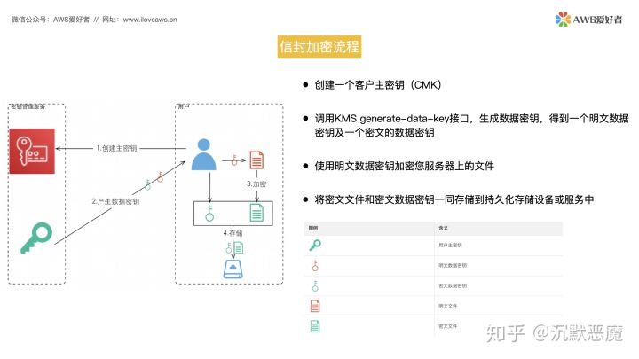
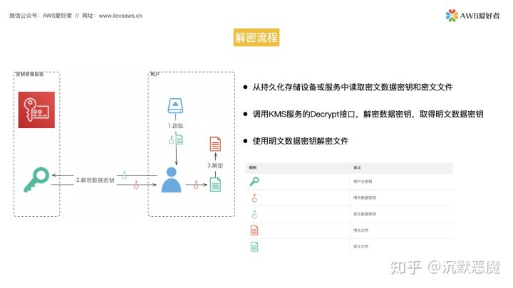

# 信封加密

## 用途

这种技术将加密数据的数据密钥封入信封中存储、传递、和使用，不再使用主密钥直接加解密数据。也就是说，信封加密使用客户主密钥生成数据密钥，然后用离线的数据密钥在本地加密大量数据，而不再使用主密钥直接加解密数据。

## 流程

### 信封加密过程

+ 客户在KMS系统创建一个主秘钥（非对称秘钥，公钥+私钥）
+ 客户调用KMS接口生成数据秘钥
	+ KMS系统根据用户的主秘钥生成一个 
		+ 明文秘钥：秘钥本身
		+ 密文秘钥：将明文秘钥按照非对称加密（如RSA）后的结果。即使用主秘钥的公钥对明文秘钥加密。
+ 客户根据明文秘钥，对需要加密的内容进行对称加密（如DES）
+ 加密后将明文秘钥丢弃
+ 将密文秘钥 和 加密后的内容 进行存储

### 信封解密过程

+ 客户从存储获取到 密文秘钥 和 加密后的内容
+ 调用KMS的解密接口，提供主秘钥的私钥将密文秘钥解密成明文秘钥
+ 使用明文秘钥将对称加密的内容进行解密
+ 获取到明文内容

## Reference
[KMS信封加密](https://zhuanlan.zhihu.com/p/143681021)
